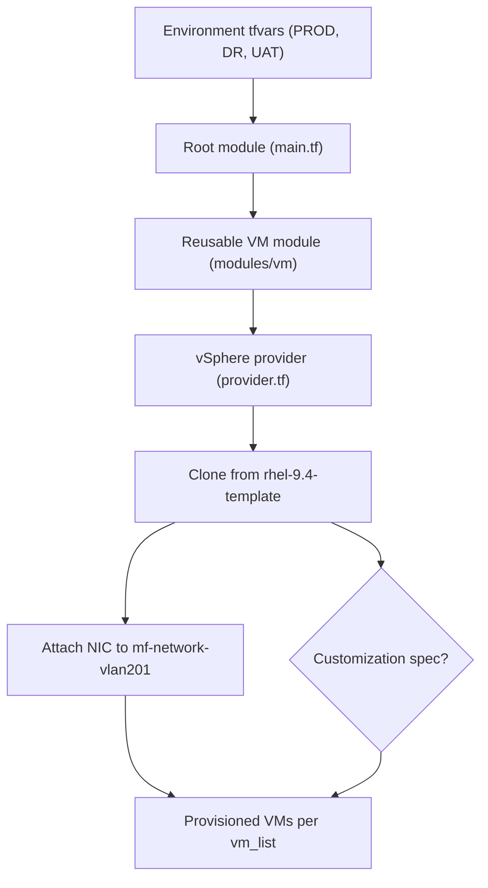

# OpenText IAM & Patch Terraform Deployment

This repository hosts a public, knowledge-sharing version of the Terraform code originally used to stand up the infrastructure foundation for the **OpenText IAM & Patch Management** initiative. Sensitive values have been removed or replaced with illustrative placeholders so the workflow can be reused as a reference implementation.

The configuration clones Red Hat Enterprise Linux 9.4 virtual machines from an existing vSphere template. Environment-specific values live under `environments/`, while reusable logic sits inside `modules/vm`.

## Prerequisites
- Terraform 1.4 or later
- vCenter access with:
  - Template: `rhel-9.4-template`
  - Network (port group): `mf-network-vlan201`
- Account permissions to browse inventory and clone VMs into the target clusters/datastores
- VMware Tools (or Open VM Tools) installed in the template if you need IP outputs

## Directory Layout
```
.
├── main.tf
├── provider.tf
├── variables.tf
├── outputs.tf
├── modules
│   └── vm
│       ├── main.tf
│       ├── variables.tf
│       └── outputs.tf
└── environments
    ├── prod.tfvars   # Main Site production
    ├── dr.tfvars     # DR Site configuration
    └── uat.tfvars    # UAT/Testing environment
```

- **Root module** wires environment settings into the VM module and exposes VM metadata.
- **`modules/vm`** resolves the datacenter, cluster, datastore, template, and network, then clones one VM per hostname in `vm_list`.
- **`environments/*.tfvars`** hold per-site inventory, compute sizing, and placement (populate with non-sensitive values before use).

## Architecture Overview


The diagram shows how environment-specific configuration feeds the root module, which delegates VM provisioning to the reusable module. The module interacts with the vSphere provider to clone the `rhel-9.4-template`, connects each VM to `mf-network-vlan201`, and optionally applies a customization spec when `customization_spec_name` is supplied.

## Variable Reference
These variables must be provided (directly or via tfvars files). Items without defaults are required.

| Variable | Required | Description |
| --- | :---: | --- |
| `vsphere_user` | ✔︎ | vSphere username (example: `administrator@vsphere.local`). |
| `vsphere_password` | ✔︎ | vSphere password (treat as sensitive). |
| `vsphere_server` | ✔︎ | vCenter FQDN or IP. |
| `datacenter` | ✔︎ | Target datacenter (usually supplied by environment tfvars). |
| `cluster` | ✔︎ | Target compute cluster. |
| `datastore` | ✔︎ | Datastore where the VMs will be created. |
| `cpu` | ✔︎ | vCPU count per VM. |
| `memory` | ✔︎ | Memory (MB) per VM. |
| `vm_list` | ✔︎ | Hostnames to provision. |
| `template_name` | optional | Template name (defaults to `rhel-9.4-template`). |
| `network_name` | optional | Port group name (defaults to `mf-network-vlan201`). |
| `wait_for_guest_net_timeout` | optional | Seconds to wait for guest networking (defaults to `0`, i.e. no wait). |
| `customization_spec_name` | optional | Name of a vSphere customization spec to apply during clone. |

## Why Terraform Prompts for Credentials
The variables `vsphere_user`, `vsphere_password`, and `vsphere_server` are required and have no defaults (`variables.tf`). Terraform will pause and ask for values during `plan/apply` if you have not supplied them via any other method. This is intentional so credentials are never hard-coded in the repository. The sections below show three convenient patterns to provide those values.

## Usage
1. Navigate to the project directory:
   ```bash
   cd DevOps-Cloud-Portfolio/Projects/infrastructure-as-code/opentext-iam-patch-terraform-vm-provisioning
   ```
2. Initialize Terraform (downloads providers and sets up the working directory):
   ```bash
   terraform init
   ```
3. Choose how you want to provide the required credential variables (pick one of the options below).

### Option A — Inline command-line variables *(example)*
```bash
terraform plan \
  -var "vsphere_user=administrator@vsphere.local" \
  -var "vsphere_password=SuperSecret" \
  -var "vsphere_server=vcenter.example.com" \
  -var-file=environments/prod.tfvars
```
- Replace `administrator@vsphere.local`, `SuperSecret`, and `vcenter.example.com` with **your** actual values; they are only illustrative examples.
- Apply or destroy the same way:
  ```bash
  terraform apply -var "vsphere_user=..." -var "vsphere_password=..." -var "vsphere_server=..." -var-file=environments/prod.tfvars
  terraform destroy -var "vsphere_user=..." -var "vsphere_password=..." -var "vsphere_server=..." -var-file=environments/prod.tfvars
  ```

### Option B — Environment variables *(example)*
```bash
export TF_VAR_vsphere_user="administrator@vsphere.local"
export TF_VAR_vsphere_password="MyStr0ngPass!"
export TF_VAR_vsphere_server="vcenter.example.com"

terraform plan -var-file=environments/prod.tfvars
```
- Again, substitute `administrator@vsphere.local`, `MyStr0ngPass!`, and `vcenter.example.com` with your own credentials.
- Terraform automatically maps `TF_VAR_<name>` environment variables to matching Terraform variables.
- After you finish, clear them from the shell history:
  ```bash
  unset TF_VAR_vsphere_user TF_VAR_vsphere_password TF_VAR_vsphere_server
  ```

### Option C — Local auto-loaded tfvars file *(example)*
1. Create a file named `local.auto.tfvars` in the project root (ensure it’s listed in `.gitignore`).
2. Populate it with your credentials:
   ```hcl
   vsphere_user     = "administrator@vsphere.local"
   vsphere_password = "MyStr0ngPass!"
   vsphere_server   = "vcenter.example.com"
   ```
3. Run Terraform without retyping the credentials each time:
   ```bash
   terraform plan -var-file=environments/prod.tfvars
   ```
- The sample values above are placeholders—replace them with the real details for your environment.

### Switching Environments
Use a different tfvars file to target another site, e.g.:
```bash
terraform plan -var-file=environments/dr.tfvars
terraform apply -var-file=environments/uat.tfvars
```
Apply the credential-supply method (Option A/B/C) exactly the same way.

If you maintain a vSphere customization spec (for static IP addressing or additional guest settings), provide its name through `-var "customization_spec_name=RHEL-StaticIP-Spec"` or add it to your tfvars file; the module will automatically link that spec during cloning.

## Outputs
- `vm_names` — Hostnames of the provisioned VMs.
- `vm_ids` — vSphere managed object IDs.
- `vm_ips` — IP addresses reported by VMware Tools (may be `null` until tools report back).

## Cleanup
To tear down the resources created for an environment (example):
```bash
terraform destroy \
  -var "vsphere_user=administrator@vsphere.local" \
  -var "vsphere_password=SuperSecret" \
  -var "vsphere_server=vcenter.example.com" \
  -var-file=environments/prod.tfvars
```
Replace the example values with your actual credentials, or rely on the environment variable / auto tfvars approaches described above.

## Best Practices
- Never commit real passwords; use Options B or C to keep secrets out of version control and terminal history.
- Review `terraform plan` output carefully before applying changes in production.
- Ensure the RHEL template has VMware Tools running if you rely on IP outputs, and adjust `wait_for_guest_net_timeout` if needed.
